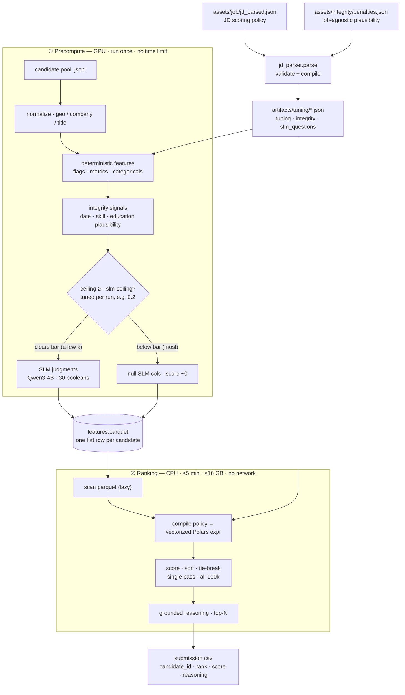
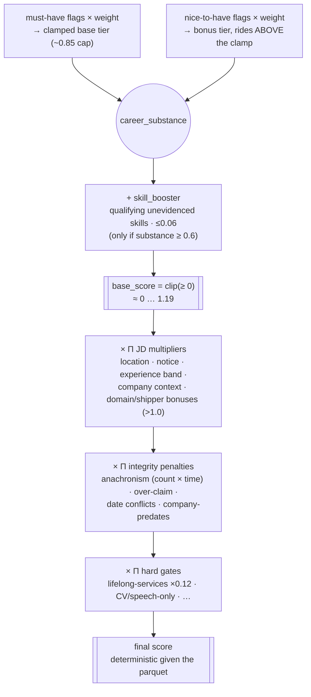

# candidate-ranker

Ranks the top N candidates (default 100) from a pool for a single ML engineering role and
writes `candidate_id,rank,score,reasoning` as a CSV. Designed for the Redrob Hackathon v4:
100k candidates, one job description, reproducible results on CPU in under 5 minutes.

---

## How it works

Two stages with a Parquet handoff. The expensive, non-deterministic work (parsing,
normalization, SLM judgments) runs **once** in precompute and is frozen into a flat Parquet
file; the ranker is a pure, deterministic function of that file plus the compiled policy.



**Key invariant — no candidate is ever removed.** Gates, honeypots, and penalties drive a
score toward 0, but the row stays in the ranking, so weak or implausible profiles *sink*
rather than disappear. The 100k pool ranks in **< 0.2 s** on CPU.

### What the score is made of

The final score is a ranking key (not a normalized probability): a single SLM-dependent
**substance** core, lifted by deterministic **multipliers** and pulled down by deterministic
**penalties / gates**.



`career_substance` is the **only** part that depends on the SLM; everything that multiplies it
is a deterministic function of the parquet columns. That is what makes the best-possible score
an exact, computable **ceiling** — used by precompute to skip the SLM for candidates who could
never place, saving the GPU pass for the few thousand who can. The cutoff (`--slm-ceiling`) is
tuned per run, not fixed — we most often use `0.2`, which selects a few thousand of the 100k;
a lower bar admits more.

→ Full details, every stage type, and the predicate language: [docs/architecture.md](docs/architecture.md)

---

## Quick start

### 1 — Install (CPU ranking environment)

```bash
python3.12 -m venv .venv
.venv/bin/pip install -r requirements.txt
```

For GPU precompute, see [docs/precompute.md](docs/precompute.md).

### 2 — Parse the policy

```bash
python -m src.jd_parser.parse
```

Validates `assets/job/jd_parsed.json` and `assets/integrity/penalties.json` and writes
three artifacts to `artifacts/tuning/`. Run once; re-run whenever you edit either source.

### 3 — Precompute features

```bash
# CPU-only (deterministic features, no SLM) — works in .venv
./precompute.sh --pool sample --no-slm

# Full run with SLM on the GPU box
PYTHON=.venv-gpu/bin/python ./precompute.sh --pool 100k --dtype auto
```

### 4 — Rank

```bash
./ranker.sh --pool 100k
./ranker.sh --pool 100k --out results/100k/submission.csv --debug
```

### 5 — Validate submission

```bash
python -m src.features.validate_submission results/100k/submission.csv
```

---

## Sandbox / demo

A hosted Streamlit demo ([`streamlit_app.py`](streamlit_app.py)) runs the **online
ranking stage** end-to-end on a chosen pool and produces a ranked CSV — CPU-only,
well under the 5-minute budget (the full 100k pool ranks in <0.2 s). It deliberately
runs *only* the ranking stage: the offline feature-precompute step (GPU) is not part
of the sandbox budget; the precomputed parquet is the committed handoff between the
two stages.

Pools offered: `sample` (50), `1k` (1,000), three `100_rand_*` (100) and three
`1k_rand_*` (1,000) — reproducible random subsets, built by
[`scripts/make_demo_pools.py`](scripts/make_demo_pools.py) — plus `100k` (ranking
only). The sidebar also offers read-only downloads of the compiled scoring policy
(`tuning.json`, `integrity.json`).

The 465 MB `100k_pool.jsonl` stays in **Git LFS** but is excluded from the default
fetch via [`.lfsconfig`](.lfsconfig), so a normal clone (including Streamlit Cloud)
pulls only its pointer — the 100k pool ranks from the committed 2.5 MB parquet and its
raw download is disabled in the UI. To materialise the full file (Stage-3 reproduction
or re-running precompute):

```bash
git lfs pull --include="assets/candidates/100k_pool.jsonl"
```

Run locally:

```bash
pip install -r requirements.txt          # includes streamlit + psutil
streamlit run streamlit_app.py
```

Deploy: point Streamlit Cloud at this repo; it auto-detects `streamlit_app.py` and
installs `requirements.txt`. Docker fallback (spec-permitted alternative):

```bash
docker run --rm -p 8501:8501 -w /app -v "$PWD":/app python:3.12-slim \
  bash -c "pip install -r requirements.txt && streamlit run streamlit_app.py --server.port 8501 --server.address 0.0.0.0"
```

---

## Repository layout

```
assets/
  job/jd_parsed.json          scoring policy (job-specific)
  integrity/penalties.json    plausibility penalties (job-agnostic)
  candidates/                 100k_pool.jsonl · 1k_pool.jsonl · sample_pool.json
  schema/candidate_schema.json
src/
  jd_parser/parse.py          validate policy sources → write artifacts/tuning/*
  models/                     Pydantic models: Candidate · Policy · Tuning · features
  features/                   normalize · metrics · derive · integrity · build · utilities
  precompute/                 parse pool → deterministic features → SLM → parquet
  ranking/                    compile policy → score → top-N CSV + reasoning
artifacts/                    generated
  tuning/                     tuning.json · slm_questions.json · integrity.json
  <pool>/                     features.parquet
results/                      generated (gitignored)
  <pool>/                     submission.csv 
precompute.sh                 wraps python -m src.precompute.main
ranker.sh                     wraps python -m src.ranking.main
requirements.txt              CPU ranking deps (pydantic · polars · orjson)
requirements-gpu.txt          GPU precompute deps (vllm · transformers · hf_hub)
```

---

## Documentation

| doc | covers |
|---|---|
| [docs/architecture.md](docs/architecture.md) | end-to-end data flow · scoring formula · multiplier types · predicate language · SLM pre-filter ceiling · Mermaid diagrams |
| [docs/precompute.md](docs/precompute.md) | GPU setup · vLLM + Qwen3-4B · SLM question schema · incremental/resumable runs · all flags · evidence repair |
| [docs/ranker.md](docs/ranker.md) | ranking step in detail · all CLI flags · scoring stages · reasoning composition · debug output |
| [docs/features.md](docs/features.md) | every file in src/features/ — normalize · metrics · derive · integrity · build · repair_evidence · export_csv · validate_submission |
| [docs/integrity.md](docs/integrity.md) | job-agnostic plausibility layer — design rationale · signals · penalty compounding · the prevalence/cliff test for adding a detector (with this dataset's honeypot-audit findings) · tuning |
