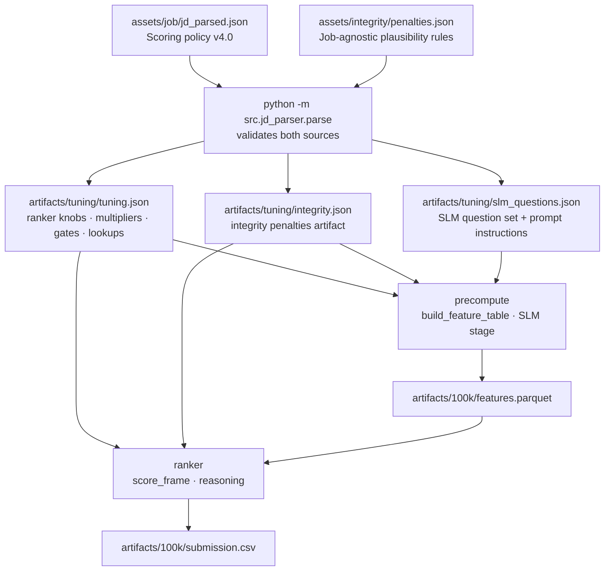
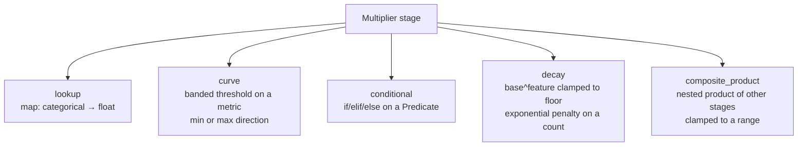
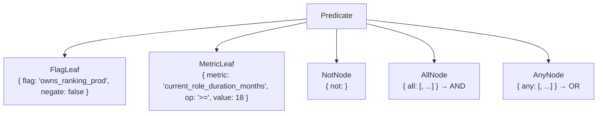
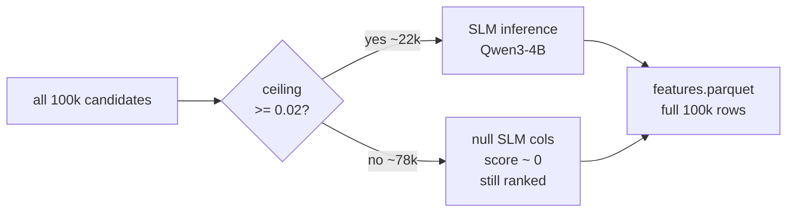
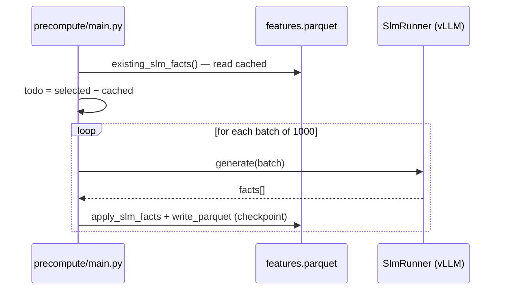

# Architecture

## Overview

candidate-ranker is a two-stage pipeline. The expensive work (parsing, normalization,
feature extraction, SLM inference) runs once in **precompute** on a GPU with network
access and writes a flat Parquet file. The **ranker** then reads that file, compiles the
entire scoring policy into vectorized Polars expressions, scores all candidates in a single
pass, and emits the top-N CSV — in milliseconds, on CPU, with no network.

```mermaid
flowchart LR
    subgraph PRECOMPUTE["Precompute (GPU + network, no time limit)"]
        direction TB
        A[candidate pool\n.jsonl / .json] --> B[parse + validate\nPydantic v2]
        B --> C[normalize\ngeo / company / title]
        C --> D[deterministic features\nflags · metrics · categoricals]
        D --> E[integrity signals\njob-agnostic plausibility]
        E --> F{ceiling\npre-filter}
        F -->|ceiling >= 0.02| G[SLM inference\nQwen3-4B · vLLM]
        F -->|ceiling < 0.02| H[keep null SLM cols\nscore ~0, still ranked]
        G --> I[(features.parquet\none row per candidate)]
        H --> I
    end

    subgraph RANKING["Ranking (CPU · no network · ≤5 min · ≤16 GB)"]
        direction TB
        I --> J[scan parquet\nPolars lazy]
        J --> K[compile policy\nPolars expressions]
        K --> L[score + sort + tie-break\nvectorized]
        L --> M[top-N reasoning\nPython, ≤100 rows]
        M --> N[submission.csv\ncandidate_id · rank · score · reasoning]
    end
```



The key invariant: **no candidate is ever removed**. Honeypots, gates, and penalties drive
a score toward 0 but the row stays in the ranking so penalised profiles sink rather than
disappear.

---

## Config and artifact flow

All inputs are under `assets/` (hand-authored, committed). All outputs are under
`artifacts/` (generated, gitignored). Two parallel config trees — the JD and the integrity
layer — stay independent so editing one never disturbs the other.



Re-tuning numeric knobs → re-run the **ranker** only (seconds).
Re-tuning lookup membership → re-run the **CPU feature build** (`--no-slm`, preserves SLM
facts).
Only the SLM step is expensive, and it is incremental/resumable.

---

## The feature table (features.parquet)

One flat, typed row per candidate. Every column is a scalar — no nested types — so the
ranker can compile the whole policy into a single vectorized Polars pass.

```
candidate_id          String         primary key
─── deterministic flags (Boolean) ───────────────────────────────
current_is_services   has_ai_native   has_product_company
majority_career_services   titles_escalating   is_local
prefers_remote   open_to_work_flag   enterprise_lifer
─── integrity flags (Boolean) ────────────────────────────────────
end_before_start   career_months_overrun   role_months_overrun
current_role_date_conflict   senior_title_pre_graduation
─── SLM flags (Boolean, null until SLM runs — 30 questions) ──────
owns_retrieval_prod   vector_db_prod   owns_eval_framework
strong_python_prod   retrieval_ops_depth   owns_ranking_prod
shipped_endtoend_at_scale   ltr_experience   reranker_twostage
relevance_judgment_pipeline   llm_finetuning   ab_testing_ml
distributed_systems_scale   hrtech_or_marketplace_exp   external_validation
first_person_ownership   primarily_adjacent   observer_not_owner
manager_not_builder   cv_dominant   speech_dominant   robotics_dominant
nlp_ir_significant   research_not_applied   ic_role
llm_api_wrapper_only   pre_llm_ml_production   is_hobbyist_or_self_learner
built_recruiter_or_jd_matching   scrappy_shipper
(the policy's `derived_flags` block then recomputes strong_python_prod = itself OR'd with
 production-ownership, stashing the raw SLM answer as strong_python_slm — see ranker.md)
─── metrics (Float64) ────────────────────────────────────────────
years_of_experience   applied_ml_years
median_tenure_last_3_months   current_role_duration_months
last_active_days   recruiter_response_rate   interview_completion_rate
saved_by_recruiters_30d   applications_submitted_30d
notice_period_days   github_activity_score
num_qualifying_unevidenced_skills
num_education_overlaps   num_skill_anomalies   num_proficiency_anomalies   num_skill_anachronisms
skill_anachronism_years   years_predating_company
─── categoricals (String) ────────────────────────────────────────
current_title_bucket   location_relocation_bucket   verification_state
─── display fields (String / Boolean) ────────────────────────────
current_title   current_company   location   country
preferred_work_mode   willing_to_relocate
─── SLM text (String, null until SLM runs) ───────────────────────
subject_of_primary_work   evidence
```

The schema is derived from the policy at runtime via `src/models/features.py:parquet_schema`
so it cannot drift from what the scorer references.

---

## Scoring formula

```
derived_flags    = recompute selected flags from a predicate over the columns   ← pre-scoring
                   (e.g. strong_python_prod |= production-ownership; from the policy block)

career_substance = base_tier + bonus_tier            ← the only SLM-dependent part
  base_tier  = clamp(Σ(must-have flags × weight) × Π(internal gates), low, high)
  bonus_tier = Σ(nice-to-have flags × weight) × scale(base_tier / knee)
               ↑ rides ABOVE the base clamp — NOT re-capped at 1.0

skill_booster    = min(max, per_skill × num_qualifying_unevidenced_skills)
                   if career_substance >= 0.6 else 0

base_score       = clip(career_substance + skill_booster, lower=0)   ← lower bound ONLY

score            = base_score
                   × Π(JD multiplier stages)         ← all deterministic
                   × Π(integrity penalty stages)     ← all deterministic, no hard zero
                   × Π(hard gates)                   ← all deterministic

sub-threshold    score == 0  →  substance / max(substance) × (min_positive_score × headroom)
floor              ← deterministic, score==0 tail only; re-spreads the unqualified by a
                     substance proxy, strictly below every positive score (from the policy block)
```

`career_substance` is the **only SLM-dependent part**. The base tier saturates at the JD's
must-have completeness, but the nice-to-have **bonus tier rides above that clamp** so two
must-have-complete engineers are still separated by how many JD differentiators each brings —
the final score is a ranking key, not a normalized [0,1] probability. With this policy the
base tier maxes at its additive sum (~0.85), the bonus adds ~0.28, and `skill_booster` adds
up to 0.06, so **career_substance tops out ≈1.13 and base_score ≈1.19** — and the positive
(>1.0) multiplier stages push the final score above 1.0 for the strongest profiles. Because
every multiplier, penalty, and hard gate reads only deterministic columns, the best-possible
score for any candidate is still an exact, computable upper bound — the "ceiling" used by the
SLM pre-filter (`ceiling_expr` computes that ~1.19 base headroom from the policy, not 1.0).

The **sub-threshold floor** is the last step. A candidate who fires no base or bonus flag lands
at `base_score == 0`, hence `score == 0`; on the full pool these sit far below the submitted
top-N, but a small CPU/`--no-slm` sample (the reproducibility sandbox) is mostly such rows, and
a flat 0 collapses their order onto the `candidate_id` tie-break. The floor re-spreads that
zero block by a deterministic, SLM-free substance proxy — ML-credited experience, raw
experience, and title-bucket relevance, all named with their weights in
`scoring.sub_threshold_floor` — mapped into a band strictly below the smallest positive score
(`min_positive × headroom`, `headroom < 1`). Positive scorers are never touched, so any pool's
ranked head — including the 100k submitted top 100 — is unchanged; only the order *within* the
unqualified tail differs. Omitting the policy block disables it.

---

## Multiplier stage types

All five types compile to Polars expressions via `src/ranking/scorer.py:_stage_expr`.



| type | key fields | used for |
|---|---|---|
| `lookup` | `feature`, `map`, `default` | map a categorical to a multiplier (e.g. title bucket → 1.3×) |
| `curve` | `feature`, `direction`, `bands` | step-function on a metric (e.g. applied-ML years) |
| `conditional` | `cases[{when, value}]`, `default` | predicate-gated multiplier (e.g. title_chaser) |
| `decay` | `feature`, `base`, `floor` | `max(floor, base^count)` — exponential per-count penalty |
| `composite_product` | `members`, `clamp` | nested product of stages, re-clamped |

---

## Predicate language

`when` clauses in the policy JSON are a small recursive boolean language. They compile to
`pl.Expr` via `src/ranking/predicate.py:compile_predicate` so the whole pool evaluates in
one vectorized pass.



Null SLM flags are filled with `False` before compilation (`fill_null(False)`), so absent
facts contribute nothing and fire no disqualifier — the policy's `uncertain_treatment`.

---

## SLM pre-filter (the ceiling)

Because every multiplier and gate is deterministic, the best possible score for a candidate
is exactly:

```
ceiling = best-case base_score (≈1.19, computed from the policy:
            base-tier additive sum + full bonus-tier sum + max skill_booster)
          × Π(each multiplier at its actual deterministic feature values)
          × Π(integrity penalties at actual values)
          [gates assumed 1.0 — an overestimate, so safe]
```

This is computed by `scorer.py:ceiling_expr`. It does **not** assume `base_score = 1.0`: it
sums the must-have base additive (capped at the base clamp), adds the **full** nice-to-have
bonus tier (which rides above that clamp), and adds the max skill_booster — so the ~1.19
headroom is exact, and the uncapped-base scoring change never makes the filter wrongly skip a
strong profile. The one column it must pin is `career_substance` itself (one stage,
`github_bonus`, gates on it): `select_for_slm` sets it to 1.0, which clears that gate's
`>= 0.6` threshold at its max, so the pin is correct. Precompute runs the SLM only for
candidates whose `ceiling >= --slm-ceiling` (default 0.02). Skipped candidates keep null SLM
columns, score ~0, and stay ranked. The ceiling is an upper bound: a skipped candidate cannot
reach the top-N even with a perfect SLM result.

Several multipliers exceed 1.0 (`domain_mandate_bonus` ×1.05, `narrow_domain_bonus`
×1.08, `shipper_bonus` ×1.03, `github_bonus` ×1.03, `behavioral` up to ~1.05). They are gated
on SLM/behavioural columns evaluated at their actual values here, so the ceiling counts them
when their deterministic gate already holds and conservatively omits them otherwise — still an
upper bound, so no placeable candidate is dropped at the permissive 0.02 threshold.



---

## Resumable / incremental SLM

The SLM stage checkpoints every `--batch-size` (default 1000) candidates by writing the
parquet. On re-run without `--force`, it reads cached facts from the existing parquet and
only computes `selected − cached`. Cancelling loses at most one in-flight batch.



`--no-slm` re-derives deterministic features on CPU while **preserving** cached SLM facts
(merges them back via `apply_slm_facts` before writing).

---

## Tie-break

Within equal scores the ranker uses `candidate_id asc` as the sole tie-breaker.
`candidate_id` is unique, so the sort is fully deterministic. Implemented as a
two-key sort in `ranking/main.py:rank`.
