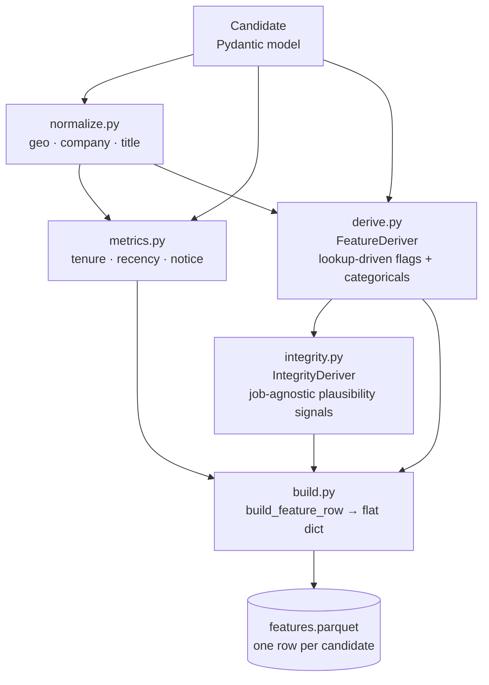
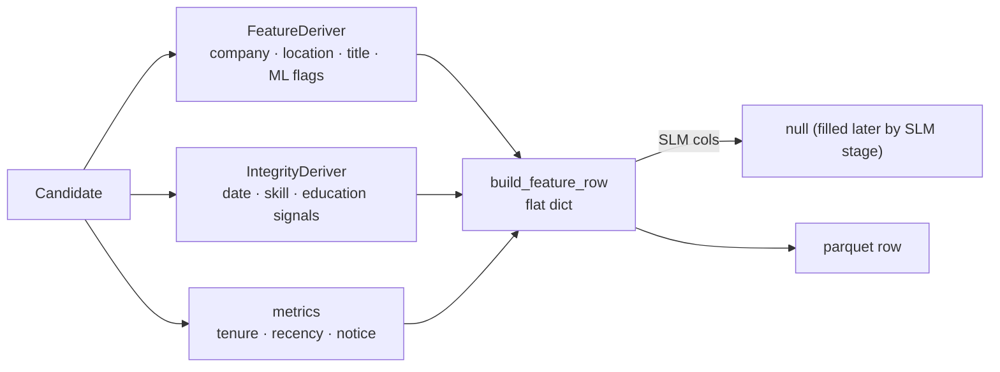

# Feature pipeline

Everything under `src/features/` handles the CPU side of precompute: parsing raw
candidate data into a flat, typed feature row that the ranker can score without touching
JSON or Python loops. There is no GPU code here; these modules also run in `--no-slm` mode
on a CPU-only machine.



---

## normalize.py

**Purpose:** reduce noisy free-text strings to canonical lookup-safe forms.

All normalization is **lowercase + trim + collapse-whitespace only**. Punctuation (`.`, `(`,
`—`, `&`) is intentionally preserved so it does not corrupt tokens that are part of
canonical lookup strings. This is why `normalize_title` is not the place to strip
abbreviation periods — that would break lookups that include them.

```python
normalize_token(value)   # lowercase · strip · collapse whitespace (base primitive)
normalize_city(location) # "City, Region" → city → alias map (Bengaluru→Bangalore, ...)
normalize_company(name)  # normalize_token + alias map (TCS, Byju's, ...)
normalize_title(title)   # = normalize_token  (no extra transform)
```

**Alias maps:**

| map | entries | why |
|---|---|---|
| `_CITY_ALIASES` | Bengaluru→Bangalore, Gurugram→Gurgaon, New Delhi→Delhi | common alternate spellings of the same city |
| `_COMPANY_ALIASES` | Tata Consultancy Services→TCS, Byjus→Byju's | brand names that appear in multiple forms in data |

**Edge note:** `normalize_title` does not strip trailing punctuation, so `Sr.` does not
match the seniority keyword `" sr "`. This is deliberate — the seniority ladder uses
space-padded word matching that works correctly for the full title distribution in the pool.

---

## metrics.py

**Purpose:** compute per-candidate numeric metrics that depend only on the candidate's own
data, not on any policy lookup.

```python
current_role_duration_months(candidate)   # duration of the role flagged is_current
median_tenure_last_3_months(candidate)    # median of the 3 most recent roles
                                          # career_history is most-recent-first
last_active_days(candidate, reference)    # (reference_date - last_active_date).days
                                          # returns NaN if last_active_date is None
                                          # NaN falls through every recency band to default
```

`reference_date` is the most-recent `last_active_date` in the pool (not `date.today()`)
so the recency metric is stable within a run even if the data is old.

---

## derive.py

**Purpose:** lookup-driven feature derivation. `FeatureDeriver` is built once from a
`Tuning` instance and precomputes normalized lookup sets (sets/dicts), then reuses them
across the full candidate pool.

### Seniority ranking

Used by `titles_escalating` here and by `integrity.py:senior_title_pre_graduation`. The
ladder assigns a coarse rank 0–4 by space-padded keyword matching:

| rank | keywords |
|---|---|
| 0 | intern |
| 1 | junior · jr · associate · trainee |
| 2 | *(default)* |
| 3 | senior · sr · lead · principal · staff |
| 4 | manager · head · director · vp · chief · cto |

Later tier-checks override earlier ones, so "senior engineering manager" → 4.

The ladder comes from the job-agnostic integrity asset
(`assets/integrity/penalties.json → seniority_ladder`, a `{ default, tiers[] }` object) and is
the single source of truth shared by both consumers. `_seniority_rank(title, ladder)` takes it
as an argument: `FeatureDeriver` receives it from the integrity policy (and falls back to the
built-in default when precompute runs without one), and `IntegrityDeriver` reads it from its own
policy. Seniority is a generic notion, so the ladder lives with the job-agnostic layer rather
than in the JD policy.

### Company flags

| flag | meaning |
|---|---|
| `current_is_services` | current company is in `it_services` lookup |
| `has_ai_native` | any career role at an `ai_native` company |
| `has_product_company` | any career role at any company in `product_set` (expands to named category members) |
| `majority_career_services` | >50% of total career months spent at IT-services companies |
| `enterprise_lifer` | every career role at a `10001+`-size employer (≥2 roles). A diagnostic-only column that scoring does not read: the JD rejects consulting-*only* careers (handled by the services flags) but not product/big-co tenure, so headcount alone carries no penalty. |

### Location / title flags

| flag | meaning |
|---|---|
| `is_local` | current city is in `local_cities` lookup |
| `titles_escalating` | seniority ranks of the 3 most recent roles are strictly increasing (oldest→newest) |

### Categoricals and metrics

| output | how |
|---|---|
| `current_title_bucket` | lookup in `title.current_title_buckets`; unmatched → `"neutral_read_description"` |
| `location_relocation_bucket` | local / commutable / tier1 / other_india / outside, plus `_relocating` / `_not_relocating` suffix |
| `verification_state` | `"both"` / `"one"` / `"neither"` from verified_email + verified_phone |
| `applied_ml_years` | Σ(role_months/12 × ml_credit_factor) capped at years_of_experience |
| `num_qualifying_unevidenced_skills` | count of skills in the policy's qualifying list |

---

## integrity.py

**Purpose:** job-agnostic profile-plausibility signals. `IntegrityDeriver` is built from
`IntegrityPolicy` (all thresholds from config, nothing hardcoded) and computes one dict per
candidate.

See [integrity.md](integrity.md) for the full design rationale. The signals it produces:

### Date-consistency signals (flags)

| signal | fires when |
|---|---|
| `end_before_start` | any career role has `end_date < start_date` |
| `career_months_overrun` | total career months > `years_of_experience × 12 + overrun_slack` |
| `role_months_overrun` | any single role duration > the same threshold |
| `current_role_date_conflict` | non-current role has no end_date, or current role has an end_date |
| `experience_exceeds_career_span` | `years_of_experience` > (earliest role start → reference date) span + `experience_span_buffer_years` — the **inverse** of the overrun checks (stated experience outgrows the whole documented career, not the role sum) |

### Seniority / education signals (flags)

| signal | fires when |
|---|---|
| `senior_title_pre_graduation` | any role with `_seniority_rank(title) >= seniority_min_rank` starts before the earliest degree end year |

### Count-valued signals (metrics)

| signal | what it counts |
|---|---|
| `num_education_overlaps` | pairs of education spans that overlap |
| `num_skill_anomalies` | skills whose `duration_months > years_of_experience × 12 + anomaly_buffer_months` (the buffer absorbs ordinary pre-career use — college, side-projects, hackathons, open-source between jobs — so only large over-claims count) |
| `num_proficiency_anomalies` | skills marked `expert`/`advanced` with `duration_months == 0` |
| `num_skill_anachronisms` | skills in `tool_eras` whose implied start precedes the tool's era by more than `anachronism_buffer_months` |
| `skill_anachronism_years` | total beyond-buffer overrun in years across those skills (the magnitude); a lone anachronism has `anachronism_grace_years` subtracted, two or more are charged in full |

`implied_start = reference − duration_months / 12`, where both `reference` and each tool era
are **fractional years** (month precision). A `tool_eras` value is a bare year — read as that
January, the earliest the tool plausibly existed — or a `"YYYY-MM"` string where the real
release month is known (e.g. `chatgpt: "2022-11"`), which tightens the boundary. Carrying the
month on both sides removes the systematic ~half-year inflation that truncating `reference` to
January used to add to every overrun.

### External-grounding signal (metric)

| signal | what it measures |
|---|---|
| `years_predating_company` | largest gap, in years (net of `company_predates_buffer_months`), by which a role's start predates its company's founding (`company_founding` map); 0 when no role predates its company |

A role whose own dates are internally consistent can still be impossible against the outside
world — the company did not exist yet. This is the one signal that reads an external fact:
`company_founding` in `penalties.json`, the company analogue of `tool_eras` and following the
same bare-year-or-`"YYYY-MM"` form (e.g. `Google: "1998-09"`; a bare year is read as that
January). The role's **actual start month** is compared against the founding date's fractional
year, and `company_predates_buffer_months` (the founding-date analogue of `anachronism_buffer_months`)
absorbs a start a month or two ahead of the public founding date. Only companies named in the
map are checked, so the pool's fictional placeholder companies are never flagged. The penalty
curve tolerates one year (stealth/incubation before a public founding date) and escalates
steeply past it.

---

## build.py

**Purpose:** assemble one flat feature dict per candidate, with all columns in the order
the parquet schema expects.

`build_feature_row(candidate, deriver, reference_date, integrity_deriver=None)` calls the
functions above and merges their outputs:



SLM flag columns (`features.flags.slm`) and text columns (`subject_of_primary_work`,
`evidence`) are left `None` in the deterministic pass and filled later by
`slm_input.py:apply_slm_facts`.

The column order matches `models/features.py:parquet_schema` exactly, which is derived from
the policy at runtime — so adding a flag to the JD automatically extends the schema.

---

## repair_evidence.py

**Purpose:** one-shot data repair for Chinese code-switching in the SLM `evidence` column.
The SLM (Qwen3-4B) occasionally emits Chinese for an English word inside the free-text
evidence span (a per-role phrase digest, max 700 chars). The boolean flags are
structurally constrained by guided decoding and are always clean; `evidence` is a free-text
SLM column that the scorer never reads. The submission's `reasoning` text does not quote it
either, so this repair is cosmetic — it only matters if you surface the parquet `evidence`
column elsewhere (e.g. ad-hoc review).

**Strategy:** translate frequent, cleanly-mappable phrases using the `_RESTORE` map (longest
match first, space-padded to avoid word fusion), then cut at the first remaining CJK/Hangul
character (rare mid-word fragments), then trim dangling connectors at the tail.

```bash
# dry-run: show counts and sample transforms, write nothing
python -m src.features.repair_evidence --parquet artifacts/100k/features.parquet --dry-run

# repair in place (backs up to features.parquet.bak by default)
python -m src.features.repair_evidence --parquet artifacts/100k/features.parquet

# skip the backup copy
python -m src.features.repair_evidence --parquet artifacts/100k/features.parquet --no-backup
```

Only the `evidence` column changes; all other columns — including all SLM boolean flags and
scores — are byte-identical to the input. Re-run the ranker after to regenerate the CSV.

---

## export_csv.py

**Purpose:** export one or more parquet files under an artifacts directory to CSV for
human inspection. **Not a pipeline stage** — run on demand.

```bash
# export all parquet files under a pool
python -m src.features.export_csv --artifacts artifacts/100k

# export only the features file
python -m src.features.export_csv --artifacts artifacts/100k --files features

# write to a specific output directory
python -m src.features.export_csv --artifacts artifacts/100k --output /tmp/inspect
```

List-typed columns are joined with `"; "`. Struct columns are JSON-encoded. **CSV is lossy
and for eyes only** — the pipeline always reads the parquet.

---

## validate_submission.py

**Purpose:** check that a submission CSV meets the challenge spec before submitting.

```bash
python -m src.features.validate_submission artifacts/100k/submission.csv
```

Checks:
- `.csv` extension
- Row 1 is exactly `candidate_id,rank,score,reasoning`
- Exactly 100 data rows
- All `candidate_id` values match `CAND_XXXXXXX` (7 digits)
- Ranks are unique integers 1–100
- `score` values are non-increasing (rank 1 has the highest score)
- `reasoning` column is non-empty for every row

Exits 0 on success, 1 on failure with a list of issues.
