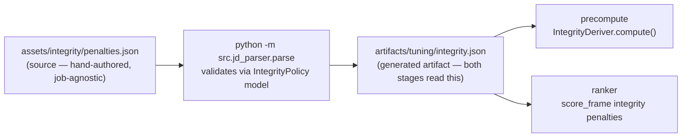
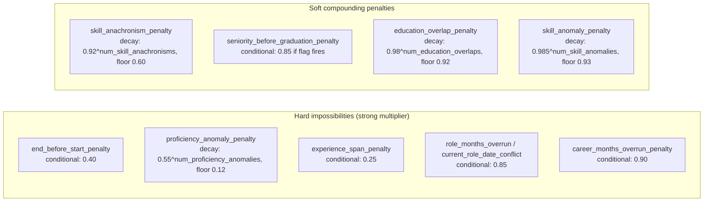

# Integrity layer

A hand-authored, job-agnostic layer of deterministic penalties for profile data that is
implausible for any genuine candidate, regardless of the role. It exists separately from
the JD tuning so that a different job can reuse these checks untouched, and editing the JD
never disturbs them.

---

## Design rationale

### Why not put this in the JD?

The JD tuning (`assets/job/jd_parsed.json`) is job-specific: its lookups, multipliers, and
gates encode preferences for *this* role (ML-focused titles, Bangalore-adjacent location,
AI-native companies). Plausibility signals like "senior title before graduation" or
"Prompt Engineering claimed for 94 months since 2018" are **wrong for a genuine candidate
regardless of what role they apply to**. Mixing them into the JD would:
- Re-run the parse step every time they change even though they're job-agnostic.
- Make it impossible to reuse them across future jobs without copy-pasting.

### Why not hardcode thresholds in code?

Previous versions hardcoded `overrun_slack_months` and `seniority_min_rank` directly in
`metrics.py`. These belong in config for the same reason multiplier weights do: you want to
tune them by editing a JSON file and re-ranking in seconds, not by grep-editing Python.

### Why multiplicative compounding instead of a single gate?

A single hard rule is brittle: one false positive drops a genuine candidate entirely. Small
compounding multipliers degrade a fabricated profile gracefully while leaving genuine
candidates unaffected:

```
genuine candidate:  trips 0 signals  →  × 1.0 × 1.0 × 1.0  = 1.0×  (no change)
fabricated profile: trips 3 signals  →  × 0.92 × 0.85 × 0.90 ≈ 0.70×  (pushed down)
```

---

## Config and artifact flow



`assets/integrity/penalties.json` is the source of truth. The artifact is regenerated by
the same `python -m src.jd_parser.parse` command that regenerates `tuning.json`.

---

## Source format

Reuses the same `Multiplier` / `Predicate` schema as the JD, so no new format or validator
is needed. Adds `tool_eras` (era map for anachronism checks) and `params` (tunable
thresholds):

```json
{
  "version": "1.0",
  "description": "Job-agnostic plausibility penalties",
  "tool_eras": {
    "prompt engineering": 2020,
    "llm fine-tuning": 2019,
    "rag": 2020,
    "langchain": 2022,
    "vector database": 2019,
    "chatgpt": 2022
    ...
  },
  "params": {
    "overrun_slack_months": 18.0,
    "seniority_min_rank": 3,
    "experience_span_buffer_years": 5.0
  },
  "features": {
    "flags": ["end_before_start", "career_months_overrun", "role_months_overrun",
              "current_role_date_conflict", "experience_exceeds_career_span",
              "senior_title_pre_graduation"],
    "metrics": ["num_education_overlaps", "num_skill_anomalies", "num_proficiency_anomalies", "num_skill_anachronisms"]
  },
  "penalties": [ ... ]
}
```

---

## Signals

All computed in `src/features/integrity.py:IntegrityDeriver`.

### Date-consistency (flags → strong penalties)

These fire on date arithmetic that is *impossible*, not just implausible. Each drives a strong
multiplicative penalty (not a hard zero — see the penalty stages below):

| flag | condition |
|---|---|
| `end_before_start` | any career role has `end_date < start_date` |
| `career_months_overrun` | Σ career months > `yoe × 12 + overrun_slack_months` |
| `role_months_overrun` | any single role duration > the same threshold |
| `current_role_date_conflict` | non-current role has no end_date, or current role has an end_date |
| `experience_exceeds_career_span` | `years_of_experience` > (earliest role start → reference date) span + `experience_span_buffer_years` |

`overrun_slack_months` (default 18) absorbs legitimate brief overlaps (notice periods,
part-time transitions) so genuine edge cases don't fire.

`experience_exceeds_career_span` is the **inverse** of the overrun checks and was added this
cycle to close a real gap. The overruns fire when the *sum of role months* outgrows the stated
experience; this fires when the *stated experience outgrows the entire documented career*. A
profile with a continuous, gap-free history (Σ months ≈ span) can never trip `career_months_overrun`,
yet still claim 16 years of experience on a 7-year timeline. That is physically impossible — the
extra years have to come from somewhere — and unlike the other anomalies it was actively *rewarded*
downstream (the experience band reads the inflated YoE as senior; `applied_ml_years = min(yoe, credited)`
lifts its ceiling). `experience_span_buffer_years` (default 5) is deliberately generous so a genuine
candidate who omits an early job — a gap of a year or two — is never flagged; only a 5+ year overshoot
of the whole career trips it. See [§ When to add a detector](#when-to-add-a-detector--the-prevalence-test)
for why this one earned a place and several lookalike checks did not.

### Seniority / education plausibility (flag → soft penalty)

| flag | condition |
|---|---|
| `senior_title_pre_graduation` | any role with `_seniority_rank(title) >= seniority_min_rank` starts before the **earliest** degree's end year |

Baselines on `min(education.end_year)` — not the latest degree — so a senior engineer who
later completes a part-time MBA does not false-positive.

`seniority_min_rank` (default 3) maps to senior / lead / principal / staff / manager+.

### Skill plausibility (metrics → decay penalties)

| metric | what it counts |
|---|---|
| `num_education_overlaps` | pairs of education spans whose year ranges overlap |
| `num_skill_anomalies` | skills claiming more months of use than `yoe × 12` |
| `num_proficiency_anomalies` | skills marked `expert`/`advanced` with `duration_months == 0` — high proficiency, zero recorded use (a hard impossibility; legitimate skills always carry a duration) |
| `num_skill_anachronisms` | skills in `tool_eras` whose implied first-use year is before the tool existed: `reference_year − duration_months/12 < era_year` |

`tool_eras` only covers skills explicitly listed in the map; unrecognized skills are
ignored. Adding a new tool = one line in `penalties.json`.

---

## Penalty stages

Defined in the `penalties` array; compiled and applied by `scorer.py:score_frame` as
ordinary multiplier stages (`mult__<id>` debug columns):

Every stage is a multiplier — there is **no** hard zero / honeypot special-case. Hard
impossibilities just get a strong multiplier; minor anomalies get a mild one. They compound
into a ranking gradient, so an implausible profile sinks without being explicitly removed.



A fabricated profile (e.g. CAND_0006567 before the integrity layer):
- `num_skill_anachronisms = 1` (Prompt Engineering, 94 months since 2018)
- `senior_title_pre_graduation = True` (Senior ML Engineer started before BSc finished)
- Result: `0.92 × 0.85 ≈ 0.782×` → score 0.97 → ~0.76 (drops out of #1)

A genuine senior engineer trips none of these → 1.0× (unaffected).

---

## When to add a detector — the prevalence test

The integrity layer is **append-only by discipline, not by impulse**. Every multiplicative
penalty that bites a fabricated profile also risks shaving legitimate candidates, so a new
detector is added only when a candidate inconsistency class passes two **objective** tests on
the real pool — never on intuition, and never on the say-so of "this seems like it could be
gamed."

1. **The cliff.** Plot the pool-wide distribution of the candidate signal (e.g. `yoe − career_span`).
   A genuinely *seeded* class shows a **cliff**: the natural population tapers to some boundary,
   then the distribution collapses to near-zero, then a tight planted cluster sits well past it.
   That gap is where the buffer goes, isolating the planted set with ~zero false positives. A
   signal that instead **ramps smoothly** down with no break is ordinary noise — penalizing it
   carpet-bombs real candidates. The histogram decides, not the author.
2. **Top-100 penetration.** A pattern only matters if it actually reaches the shortlist. If the
   candidates that exhibit it already sink to `career_substance ≈ 0` and rank in the tens of
   thousands, the profile-reading layer already handles them and a new penalty changes nothing.

### Worked examples from this dataset

| Proposed detector | Cliff? | Reaches top-100? | Verdict |
|---|---|---|---|
| **`experience_exceeds_career_span`** (YoE ≫ career span) | **Yes** — natural "omitted early jobs" tops out at +2 yr, then nothing until a planted cluster at +8 to +12 yr; ~25 profiles pool-wide | **Yes** — suspects sat at ranks 10/15/19/56, *rewarded* by the experience band | **Added** (conditional 0.25) |
| `num_proficiency_anomalies` (expert skill, 0 months) | Yes — 0-duration skills are essentially only the planted expert+0 set | No (today: all substance-0) — but a *sophisticated* honeypot could combine high substance + this tell | **Added** as a latent net (decay 0.55, floor 0.12) |
| Title inflation (lead title + micro-company + low YoE) | n/a — **premise absent**: no `1-10` company-size bucket exists; the 9 lead-titled current roles are all at 51+ companies | No (zero matches) | **Rejected** — would also penalize the scrappy founding-engineer profile the JD wants |
| Education-anchored experience (YoE − years-since-graduation) | **No** — smooth ramp: 14,644 > 0 yr, 10,173 > 1.5, 6,673 > 3, 3,470 > 5, 812 > 8 | Would demote ~10k real candidates | **Rejected** — noise, and it *misses* a real honeypot that backdated its graduation while leaving its career history at 2019 (the career-history anchor is the harder-to-fake one) |
| Duplicate role descriptions | No — 36% of the pool shares duplicated descriptions (synthetic generation artifact, not a tell) | n/a | **Rejected** — noise, not a discriminator |

The lesson the impossible-YoE find taught: the layer's earlier "looks complete" was complete
only relative to the *directions already audited*. The gap was a **new axis** — the inverse of
the overrun checks. So the standing rule is: bring a candidate honeypot on an axis the existing
detectors don't cover, run the cliff + top-100 test on the live pool, and let the data rule.
Don't add on a hunch; don't reject on one either.

---

## Tuning

Edit values in `assets/integrity/penalties.json`, then:

```bash
python -m src.jd_parser.parse        # re-validate and write artifact (seconds)
./ranker.sh --pool 100k              # re-rank (seconds, no GPU, no precompute)
```

For an even quicker experiment, edit `artifacts/tuning/integrity.json` directly and re-run
the ranker — the parse step is skipped. Commit the source change to `penalties.json`
afterward; the artifact is gitignored.

Tunable values:
- `params.overrun_slack_months` — widen to be more lenient on legitimate overlaps
- `params.seniority_min_rank` — lower to 2 to catch mid-level titles before graduation
- `params.experience_span_buffer_years` — lower to flag smaller YoE-vs-career overshoots (5.0 isolates only the seeded impossible-YoE cluster; lower it at the cost of catching candidates who merely omitted early jobs)
- `tool_eras` — add any skill that didn't exist before a certain year
- `penalties[*].base` / `penalties[*].floor` — adjust individual penalty strength
