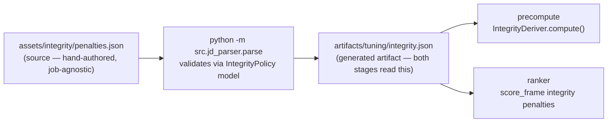
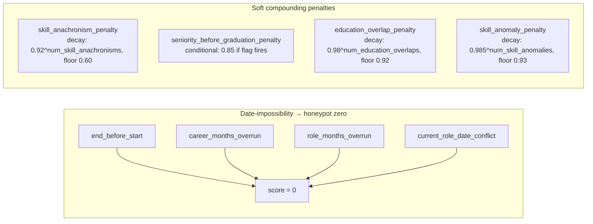

# Integrity layer

A hand-authored, job-agnostic layer of deterministic penalties for profile data that is
implausible for any genuine candidate, regardless of the role. It exists separately from
the JD tuning so that a different job can reuse these checks untouched, and editing the JD
never disturbs them.

---

## Design rationale

### Why not put this in the JD?

The JD tuning (`assets/job/jd_parsed.json`) is job-specific: its lookups, multipliers, and
gates encode preferences for *this* role (ML-focused titles, Bangalore-adjacent location,
AI-native companies). Plausibility signals like "senior title before graduation" or
"Prompt Engineering claimed for 94 months since 2018" are **wrong for a genuine candidate
regardless of what role they apply to**. Mixing them into the JD would:
- Re-run the parse step every time they change even though they're job-agnostic.
- Make it impossible to reuse them across future jobs without copy-pasting.

### Why not hardcode thresholds in code?

Previous versions hardcoded `overrun_slack_months` and `seniority_min_rank` directly in
`metrics.py`. These belong in config for the same reason multiplier weights do: you want to
tune them by editing a JSON file and re-ranking in seconds, not by grep-editing Python.

### Why multiplicative compounding instead of a single gate?

A single hard rule is brittle: one false positive drops a genuine candidate entirely. Small
compounding multipliers degrade a fabricated profile gracefully while leaving genuine
candidates unaffected:

```
genuine candidate:  trips 0 signals  →  × 1.0 × 1.0 × 1.0  = 1.0×  (no change)
fabricated profile: trips 3 signals  →  × 0.92 × 0.85 × 0.90 ≈ 0.70×  (pushed down)
```

---

## Config and artifact flow



`assets/integrity/penalties.json` is the source of truth. The artifact is regenerated by
the same `python -m src.jd_parser.parse` command that regenerates `tuning.json`.

---

## Source format

Reuses the same `Multiplier` / `Predicate` schema as the JD, so no new format or validator
is needed. Adds `tool_eras` (era map for anachronism checks) and `params` (tunable
thresholds):

```json
{
  "version": "1.0",
  "description": "Job-agnostic plausibility penalties",
  "tool_eras": {
    "prompt engineering": 2020,
    "llm fine-tuning": 2019,
    "rag": 2020,
    "langchain": 2022,
    "vector database": 2019,
    "chatgpt": 2022
    ...
  },
  "params": {
    "overrun_slack_months": 18.0,
    "seniority_min_rank": 3
  },
  "features": {
    "flags": ["end_before_start", "career_months_overrun", "role_months_overrun",
              "current_role_date_conflict", "senior_title_pre_graduation"],
    "metrics": ["num_education_overlaps", "num_skill_anomalies", "num_skill_anachronisms"]
  },
  "penalties": [ ... ]
}
```

---

## Signals

All computed in `src/features/integrity.py:IntegrityDeriver`.

### Date-consistency (flags → honeypot zeroing)

These fire on date arithmetic that is *impossible*, not just implausible. When any fires,
the scorer zeroes the score (honeypot behaviour):

| flag | condition |
|---|---|
| `end_before_start` | any career role has `end_date < start_date` |
| `career_months_overrun` | Σ career months > `yoe × 12 + overrun_slack_months` |
| `role_months_overrun` | any single role duration > the same threshold |
| `current_role_date_conflict` | non-current role has no end_date, or current role has an end_date |

`overrun_slack_months` (default 18) absorbs legitimate brief overlaps (notice periods,
part-time transitions) so genuine edge cases don't fire.

### Seniority / education plausibility (flag → soft penalty)

| flag | condition |
|---|---|
| `senior_title_pre_graduation` | any role with `_seniority_rank(title) >= seniority_min_rank` starts before the **earliest** degree's end year |

Baselines on `min(education.end_year)` — not the latest degree — so a senior engineer who
later completes a part-time MBA does not false-positive.

`seniority_min_rank` (default 3) maps to senior / lead / principal / staff / manager+.

### Skill plausibility (metrics → decay penalties)

| metric | what it counts |
|---|---|
| `num_education_overlaps` | pairs of education spans whose year ranges overlap |
| `num_skill_anomalies` | skills claiming more months of use than `yoe × 12` |
| `num_skill_anachronisms` | skills in `tool_eras` whose implied first-use year is before the tool existed: `reference_year − duration_months/12 < era_year` |

`tool_eras` only covers skills explicitly listed in the map; unrecognized skills are
ignored. Adding a new tool = one line in `penalties.json`.

---

## Penalty stages

Defined in the `penalties` array; compiled and applied by `scorer.py:score_frame` as
ordinary multiplier stages (`mult__<id>` debug columns):



A fabricated profile (e.g. CAND_0006567 before the integrity layer):
- `num_skill_anachronisms = 1` (Prompt Engineering, 94 months since 2018)
- `senior_title_pre_graduation = True` (Senior ML Engineer started before BSc finished)
- Result: `0.92 × 0.85 ≈ 0.782×` → score 0.97 → ~0.76 (drops out of #1)

A genuine senior engineer trips none of these → 1.0× (unaffected).

---

## Tuning

Edit values in `assets/integrity/penalties.json`, then:

```bash
python -m src.jd_parser.parse        # re-validate and write artifact (seconds)
./ranker.sh --pool 100k              # re-rank (seconds, no GPU, no precompute)
```

For an even quicker experiment, edit `artifacts/tuning/integrity.json` directly and re-run
the ranker — the parse step is skipped. Commit the source change to `penalties.json`
afterward; the artifact is gitignored.

Tunable values:
- `params.overrun_slack_months` — widen to be more lenient on legitimate overlaps
- `params.seniority_min_rank` — lower to 2 to catch mid-level titles before graduation
- `tool_eras` — add any skill that didn't exist before a certain year
- `penalties[*].base` / `penalties[*].floor` — adjust individual penalty strength
