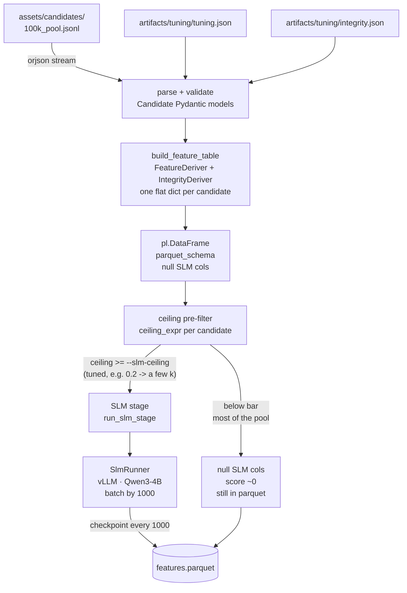

# Precompute

Builds `artifacts/<pool>/features.parquet` — one flat, typed row per candidate — from the
raw candidate pool. This is the only stage that needs a GPU and network access. Once the
parquet exists, the ranker is purely CPU with no network.



---

## Environment setup

Two Python 3.12 virtual environments: `.venv` for the CPU ranking stage and `.venv-gpu`
for precompute (built on the GPU box only).

```bash
# CPU venv — ranking + deterministic features (works everywhere)
python -m venv .venv
.venv/bin/pip install -r requirements.txt

# GPU venv — precompute (on the GPU box only)
python -m venv .venv-gpu
.venv-gpu/bin/pip install uv
# vLLM must match the CUDA driver. uv inspects the driver automatically.
# Plain pip wheel is CUDA-13; on T4 (CUDA-12) it fails to load libcudart.so.13
.venv-gpu/bin/uv pip install vllm --torch-backend=auto
.venv-gpu/bin/pip install -r requirements.txt transformers "huggingface_hub[hf_transfer]"
```

Set `PYTHON=.venv-gpu/bin/python` so `precompute.sh` uses the GPU environment.

---

## Running

```bash
# full run (GPU, SLM on)
PYTHON=.venv-gpu/bin/python ./precompute.sh --pool 100k --dtype half

# CPU-only — deterministic features only, no SLM (works in .venv)
./precompute.sh --pool sample --no-slm

# smoke test — first 50 candidates
./precompute.sh --pool 100k --limit 50 --no-slm

# explicit candidates file
./precompute.sh --candidates assets/candidates/1k_pool.jsonl
```

`precompute.sh` wraps `python -m src.precompute.main`.

### Flags

| flag | default | description |
|---|---|---|
| `--pool POOL` | — | pool name; resolves to `assets/candidates/<pool>_pool.{jsonl,json}` |
| `--candidates FILE` | — | explicit candidates file (instead of `--pool`) |
| `--out PATH` | `artifacts/<pool>/features.parquet` | output Parquet path |
| `--limit N` | — | process only the first N candidates (smoke test) |
| `--no-slm` | off | skip the SLM stage; preserves existing cached SLM facts |
| `--force` | off | recompute SLM facts for all candidates, ignoring the cache |
| `--batch-size N` | 1000 | SLM candidates scored per checkpoint write |
| `--slm-ceiling F` | 0.02 | skip SLM for candidates whose ceiling is below this value; tuned per run — commonly raised (e.g. `0.2`) to shrink the GPU pass |
| `--dtype` | auto | vLLM dtype; use `half` on GPUs without bf16 (e.g. Tesla T4) |
| `--max-model-len N` | 4096 | vLLM max sequence length; lower increases concurrency |
| `--max-tokens N` | 512 | max new tokens the model generates per candidate |

---

## Step by step

### 1 — Parse artifacts

```bash
python -m src.jd_parser.parse
```

Must run first, once per policy change. Validates `assets/job/jd_parsed.json` against the
typed `Policy` model and `assets/integrity/penalties.json` against `IntegrityPolicy`, then
writes three artifacts:

```
artifacts/tuning/tuning.json          ranker knobs + multipliers + gates + lookups
artifacts/tuning/slm_questions.json   SLM question set + system-prompt instructions
artifacts/tuning/integrity.json       job-agnostic integrity penalties
```

Failure here means the policy changed in a way the code doesn't understand — a JD-drift
early warning.

### 2 — Deterministic features

For each candidate, `precompute/main.py:build_feature_table` calls:

- `normalize.py` — canonical city / company / title forms
- `metrics.py` — tenure, recency, notice period
- `derive.py:FeatureDeriver` — company/location/title flags, categoricals, applied ML years
- `integrity.py:IntegrityDeriver` — date-consistency, education/skill plausibility signals

The result is a `pl.DataFrame` with the full `parquet_schema` — SLM columns are null.

### 3 — SLM pre-filter (ceiling)

Before running the model, `select_for_slm` computes each candidate's best-possible score
(`ceiling_expr`) by assuming `career_substance = 1.0` and evaluating all deterministic
multipliers and integrity penalties at their actual values. Candidates whose ceiling is
below `--slm-ceiling` are excluded from the SLM run; they keep null SLM columns and are
ranked at score ~0.

### 4 — SLM stage: Qwen3-4B via vLLM

The model is **Qwen/Qwen3-4B-Instruct-2507** (~8 GB in half precision), loaded once by
`SlmRunner` with prefix caching enabled.

**Why this model:**
- 4B parameters — fits on a single T4 (16 GB VRAM) with ~2 GB headroom
- Instruction-tuned — follows a strict question set reliably
- Guided JSON decoding (via `StructuredOutputsParams`) enforces the output schema, so no
  post-processing is needed for the boolean flags

**Input:** only `career_history` (per the policy's `input_scope`), with identical role
descriptions de-duplicated (this pool recombines a small set of template paragraphs across
companies; printing one verbatim under every role would let repetition anchor the model). The
system prompt (instructions + full question set) is identical for every candidate so vLLM's
prefix cache computes it once and reuses it across every inference. Only the short user message
(career history) differs per candidate.

The system prompt is **balanced for both error directions**: it weighs *every* role equally
(a capability counts as `true` when *any single* role explicitly describes it, even an old or
non-current one — never letting the current/primary role decide unrelated questions), while
keeping the anti-false-positive guard (don't credit a capability no role explicitly describes;
never infer a domain from generic words like "match"/"relevance"/"ranking"/"recommendation").
The earlier single-global-evidence design anchored all answers on one sentence and produced
false negatives for capabilities living in a secondary role; the current prompt instead asks
for **one short verbatim phrase per role** before the booleans, so every role is on the record.

**Output schema (fixed order, guided decoding):**

```json
{
  "subject_of_primary_work": "string (max 160 chars)",
  "evidence": "string (max 700 chars — one short verbatim phrase PER role, joined by ' | ')",
  "owns_retrieval_prod": true,
  "owns_ranking_prod": false,
  ...  (one boolean per question in ask[]; 30 booleans total)
}
```

`subject_of_primary_work` describes what the candidate mainly worked on.
`evidence` is the per-role phrase digest the model grounded its answers in (display-only —
the scorer never reads it).

If guided decoding fails (should not happen), the runner falls back to `_empty_fact`:
all booleans false, empty strings for text fields.

**Throughput on L4:** vLLM batches candidates, so the amortized rate is far better than the
per-candidate sequential cost — empirically about **15 min per 2k candidates** (~0.45 s each).
Wall-clock therefore scales with how many clear `--slm-ceiling`: roughly ~50 min for the ~6.5k
selected at `0.2`, longer at a lower bar. The checkpoint mechanism makes this survivable across
interruptions.

### 5 — Checkpointing / resume

After each batch of `--batch-size` candidates, the runner writes the parquet. On re-run
without `--force`, `existing_slm_facts` reads back all rows where `subject_of_primary_work`
is not null and the `todo` list is `selected − cached`. Cancelling mid-batch loses only
the candidates processed since the last checkpoint.

### 6 — `--no-slm` flag preserves cached facts

When re-running deterministic features (e.g. after tuning a lookup or an integrity
threshold), `--no-slm` rebuilds the CPU-side columns and **merges the cached SLM facts
back** via `apply_slm_facts` before writing. Without this, re-running would wipe the
overnight GPU results. Use `--force` only to intentionally discard the cache.

---

## Model download

```bash
# explicit download (also happens automatically on first precompute run)
PYTHON=.venv-gpu/bin/python -c "from src.precompute.download_model import ensure_model; ensure_model()"
```

Downloads to `assets/model/Qwen3-4B-Instruct-2507/` (gitignored). Only the files needed
for inference are fetched (config, tokenizer, safetensors weights; no README/LICENSE).
`HF_HUB_ENABLE_HF_TRANSFER=1` is set automatically for maximum download speed via the
`hf_transfer` C extension.

---

## Repair SLM evidence (no re-run)

Qwen3 occasionally code-switches into Chinese inside the `evidence` span (2–3% of rows).
The booleans are always clean (guided decoding). Fix without re-running the SLM:

```bash
# preview what would change
python -m src.features.repair_evidence --parquet artifacts/100k/features.parquet --dry-run

# fix in place (backs up to features.parquet.bak)
python -m src.features.repair_evidence --parquet artifacts/100k/features.parquet
```

Then re-rank: `./ranker.sh --pool 100k`. Only `evidence` changes; all other columns and
all scores are identical to before.

---

## Inspection

```bash
# export the parquet to CSV for human inspection
python -m src.features.export_csv --artifacts artifacts/100k

# quick column check via Python
python - <<'PY'
import polars as pl
df = pl.read_parquet("artifacts/100k/features.parquet")
print(df.schema)
print(f"rows={df.height}  cols={df.width}")
print(f"SLM scored: {df['subject_of_primary_work'].is_not_null().sum()}")
PY
```
