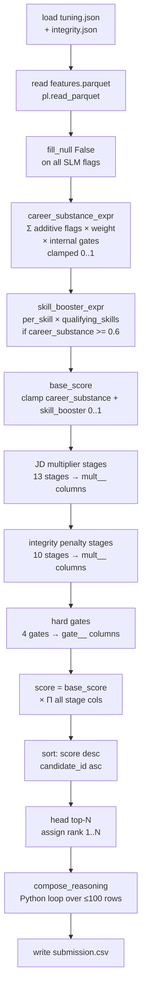

# Ranker

The ranker is the CPU-only, time-boxed scoring step. It reads `features.parquet`,
compiles the entire policy into vectorized Polars expressions, scores every candidate in a
single pass, and writes the top-N ranked CSV with grounded reasoning.

Hard constraints (ranking step only): **≤5 min wall-clock · ≤16 GB RAM · CPU-only · no
network · ≤5 GB disk**. In practice 100k candidates score in under a second; the bottleneck
is reading the parquet, not computation.

---

## Running

```bash
# via the shell wrapper (recommended)
./ranker.sh --pool 100k
./ranker.sh --pool 100k --out results/100k/submission.csv --top 100 --debug

# via Python module directly
python -m src.ranking.main --pool sample
python -m src.ranking.main --candidates assets/candidates/100k_pool.jsonl --top 100
python -m src.ranking.main --features artifacts/100k/features.parquet --out /tmp/sub.csv
```

`ranker.sh` wraps `python -m src.ranking.main` and sets the Python path. `PYTHON=...` in
the environment overrides the interpreter.

### Flags

| flag | default | description |
|---|---|---|
| `--pool POOL` | — | pool name (`sample` / `1k` / `100k`); resolves to `artifacts/<pool>/features.parquet` |
| `--candidates FILE` | — | candidate file path; uses its stem to locate the parquet |
| `--features PATH` | — | explicit path to features.parquet (overrides pool/candidates) |
| `--tuning PATH` | `artifacts/tuning/tuning.json` | override the tuning artifact |
| `--out PATH` | `results/<pool>/submission.csv` | output CSV path |
| `--top N` | `100` | number of candidates to emit |
| `--debug` | off | also write the full scored ranking (all candidates, all stage columns) to `artifacts/<pool>/debug.jsonl` |

Exactly one of `--pool`, `--candidates`, or `--features` is required.

---

## What happens inside



---

## Scoring in detail

### career_substance

The only SLM-dependent part. Computed as:

```
career_substance = clamp(
    sum_horizontal(when(flag).then(weight) for flag, weight in additive.items())
    × when(gate.when).then(gate.multiplier).otherwise(1.0)   ← for each internal gate
  , low, high)
```

SLM boolean flags that are null (no SLM fact available) are treated as `False` before this
computation — the policy's `uncertain_treatment`:
- **positive flag** (ownership): undetermined → no credit
- **disqualifier flag**: undetermined → does not fire

### skill_booster

Bonus for listing qualifying skills when the candidate already has high `career_substance`:

```
when(career_substance >= 0.6)
  → min(booster.max, booster.per_skill × num_qualifying_unevidenced_skills)
else 0
```

`num_qualifying_unevidenced_skills` is a precomputed metric (skills listed but not yet
evidenced by SLM confirmation). Skills that the SLM confirms do not double-count.

### Multiplier stage types

Each stage is compiled to a `pl.Expr` by `src/ranking/scorer.py:_stage_expr` and stored
as its own column (`mult__<id>`) for breakdown and debug:

| type | compiled as |
|---|---|
| `lookup` | `pl.col(feature).replace_strict(map, default=...)` |
| `curve` | `when/then` chain sorted by threshold, ascending or descending |
| `conditional` | `when(compile_predicate(case.when)).then(value)` chain |
| `decay` | `pl.max_horizontal(floor, base ** pl.col(feature))` |
| `composite_product` | product of member stage exprs, `.clip(low, high)` |

### Hard gates

Compiled identically to multiplier stages but stored as `gate__<id>` columns. A gate
whose predicate fires multiplies the score by its `multiplier` (typically 0.12, a near-
zero soft block rather than a hard remove).

### Date-impossibility penalties

There is **no** hard zero / honeypot special-case. Date impossibilities (end before start,
tenure overruns, current-role date conflicts) are computed in `src/features/integrity.py`,
stored in the parquet (no SLM needed), and applied as **strong multiplicative penalties** in
the integrity layer — `end_before_start` ×0.40 is the hardest. They compound with every other
stage, so an impossible profile sinks far down the ranking without ever being removed. See
[integrity.md](integrity.md) for the full penalty list.

---

## Reasoning composition

Reasoning runs in Python over the top-N rows **only** (≤100). Every clause is grounded in
values from the scored feature row — including the per-stage `mult__*` / `gate__*` columns the
scorer emits — so it never invents facts. The composition is tuned for the Stage-4 manual
review and is organised around *cause and magnitude*, not as an exhaustive field dump: each
entry leads with the verdict (monotonic with rank), names **why the candidate is in the list**
(the base-score driver) and **why they are not ranked higher** (the largest sub-1.0 multiplier,
in recruiter terms with its concrete number), then lists only *material* data-quality flags.

**Two sentence frames** keep the output un-templated. The frame is chosen per candidate from
the candidate-id digits (`% len(_FRAMES)`) — deterministic, but decorrelated from rank, so
sampled rows differ structurally as well as factually:

```
# _frame_canonical
<verdict> — <headline>. <title> at <company>, ~<yoe> yrs exp (~<applied_ml_years> yrs applied ML).
<base clause>, but downweighted ~<N>% due to <dominant drag>. Flags: <material flags>.

# _frame_profile_led
<verdict>. <title> at <company> (~<applied_ml_years> yrs applied ML of ~<yoe> total): <base clause>.
Downweighted ~<N>% due to <dominant drag>. Data-quality notes: <material flags>.
```

Sources used by `src/ranking/reasoning.py:compose_reasoning`:
- `score` → `_verdict` ("Strong/Solid/Partial/Limited match") — keyed to the final score the
  ranking sorts on, so the verdict is always monotonic with rank; bands (0.5/0.4/0.3) are
  calibrated to the compressed top-of-pool score distribution
- `current_title`, `current_company`, `years_of_experience`, `applied_ml_years` — display fields
- `base_score` + positive flags → `_base_clause` / `_select_strengths`: one anchor from
  `_ANCHOR_STRENGTHS` then the rarer `_SPECIALIST_STRENGTHS` first, so similar candidates surface
  **different** skills (variation), tagged with how maximal the base fit is
- the `mult__*` / `gate__*` stack → `_dominant_drag`: the single largest sub-1.0 JD multiplier or
  hard gate (the "why not higher"), rendered by `_drag_phrase` with its underlying number —
  `_availability_phrase` (behavioural: last-active days, recruiter-response, interview-completion),
  `_LOCATION_PHRASES`, `_TITLE_PHRASES`, experience-band / applied-ML / notice-period, or `_DRAG_LABELS`.
  Stages within `_MATERIAL` (0.025) of 1.0 are immaterial and suppressed, so a 0.99 stage is never
  framed as the reason a candidate ranks low
- data-quality penalties → `_all_flags`: material integrity penalties only (`val ≤ 1 − _MATERIAL`)
  from `_PENALTY_PHRASES` and count nouns from `_PENALTY_COUNT_NOUNS` (e.g. "2 anachronistic skills"),
  plus any fired profile-fit `CONCERN_PHRASES`, capped at 3. Integrity penalties are kept out of the
  dominant-drag selection so "why not higher" is about job fit, not data-quality noise
- when a high-base candidate is pulled low purely by fit/availability with no material flags, both
  frames append `No material data-quality flags.` so a reviewer knows the low rank isn't a red flag

There is **no** evidence/quote clause — the verbatim SLM span is intentionally omitted so the
text stays causal and the same quote never recurs across near-duplicate profiles.

---

## Debug output

With `--debug`, the ranker writes `artifacts/<pool>/debug.jsonl`: one JSON object per
candidate (the **full** scored frame, not just top-N), including every stage breakdown
column (`mult__*`, `gate__*`), all flag/metric values, and the final score. Use this to
understand why a candidate ranked where they did.

```bash
# rank a specific candidate
grep '"CAND_0006567"' artifacts/100k/debug.jsonl | python -m json.tool | less
```

---

## Utility: validate submission

After ranking, check that the CSV meets the challenge spec before submitting:

```bash
python -m src.features.validate_submission artifacts/100k/submission.csv
```

Checks: `.csv` extension, exactly `candidate_id,rank,score,reasoning` header, exactly 100
data rows, `CAND_XXXXXXX` ID format, unique ranks 1–100, non-increasing scores.
